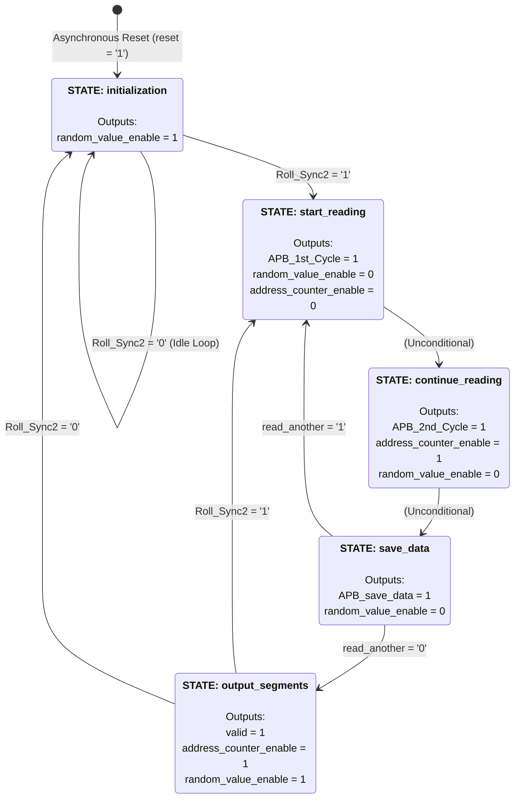

# APB-Interfaced Dice Roller with Seven-Segment Word Encoding

Status: Under active development
---
## How It Works

This project implements a digital "dice roller" that generates a pseudorandom number (1–6) on a rising clock edge when **roll** is asserted, and displays the result as a word ("one" through "six") across seven-segment displays. 

Once a value is determined, the device translates this numeric data into a word format displayed via a seven-segment display. Because standard seven-segment displays are limited in their character set, the design employs a "visual cheating" technique. For instance, the letter ‘w’ in "two" is approximated using two adjacent display characters, and the ‘x’ in "six" is rendered across three characters. These complex segment encodings are retrieved from a behavioral memory model via an **Advanced Peripheral Bus (APB) read transaction**. The final output is driven to the segments port, with a valid signal asserting once the data is stable.

## Project Scope & Contributions

This project was a structured hierarchical design exercise in Doulos's "Essential Digital Design Techniques" course, where the top-level of the design integrates different subcomponents as seen in Figure 1. The top-level design module, finite state machine, testbench, and behavioral memory model were provided. 

My specific contributions to the design include:

- **Synchronous Modulo-6 Counter(cnt6):** Designed the Register Transfer Level (RTL) for the synchronous modulo-6 counter, which is instantiated and integrated as both `random_counter` and `address_counter` in the top-level design module.
- **Synchronizer:** Designed a dual stage flip flop synchronizer to avoid the risk of input and output metastability to the finite state machine (FSM) of the top-level design.
- **APB Manager and Subordinate Logic:** Implemented the APB read transaction timing cycles required to retrieve word encodings from the behavioral memory model (apb_mem) and drive them to the segments port. ALso, their integration into the top-level design module.

**Note:** RTL designs not authored by me are excluded from this repository for copyright compliance.


Figure 1: Project Architecture Block Diagram (Source: Essential Digital Design Techniques, Doulos).

### Behavioural Memory Model Features
- Functions as a 7-segment font lookup table which stores the mapped word encodings of a rolled dice value.
- Utilizes the APB protocol for its read transactions.
- Stores word encodings in 8-byte blocks of 7-segment visual display patterns.

### Synchronous Modulo-6 Counter Features
The synchronous modulo-6 counter (`cnt6`) increments on the rising edge of `clk` and wraps back around to its initial value.

1. **Instance 1 (Pseudorandom Generator / `random_counter`):** 
   - Continuously cycles through values to simulate a rolling die. 
   - Freezes on its current count when a roll is initiated (`random_value_enable = 0`).
   - This frozen state becomes `random_value`, serving as the **upper 3 bits** (block base address) of the memory lookup.


Figure 2a: `random_counter` waveform showing continuous incrementing and value freezing when disabled.

2. **Instance 2 (Offset Indexing / `address_counter`):**
   - Remains idle until the FSM initiates the display read sequence.
   - Increments on clock edges (`address_counter_enable = 1`) to step through characters of the selected dice word.
   - This incrementing state becomes `address_offset`, serving as the **lower 3 bits** (byte offset index) of the memory lookup.
  
  

Figure 2b: `address_counter` waveform demonstrating idle holding and sequential address stepping when enabled.

### Top-Level Design Features

#### 1. Top-Level Input/Output Ports

**Inputs**

- **Global System Clock:** The primary timing reference for the top-level design and subcomponents.  
- **Asynchronous Reset:** The system-wide initialization signal that instantly forces the top-level design and all subcomponents into a known starting state.  
- **Data Input:** The asynchronous `roll` signal is synchronized to the system clock on the rising edge of `clk` before entering the FSM control logic.
  
```vhdl
Synchronizer : process(clk)
begin
    if rising_edge(clk) then
        Roll_Sync1 <= roll;
        Roll_Sync2 <= Roll_Sync1;
    end if;
end process;
```

**Outputs**

- **Segments:** Each element of `segments` corresponds to a single seven-segment display element and displays the generated dice roller value as an array of logic values.

- **Valid:** Asserted when display output is stable and valid.

#### 2. Moore Finite State Machine (FSM)

The FSM follows a synchronous Moore implementation consisting of next-state combinational logic, a clocked state register, and separate output decoding logic to ensure glitch-free execution.

```mermaid
graph TB
    %% Define Block Shapes
    IN([Inputs])
    NEXT_LOGIC[Next-State Logic<br/>Combinational]
    REG["State Register<br/>(Clocked Flip-Flops)"]
    STATE_DOT((( )))
    OUT_LOGIC[Output Logic<br/>Combinational]
    OUT([Outputs])

    %% Main Forward Path
    IN --> NEXT_LOGIC
    NEXT_LOGIC -->|next_state| REG
    
    %% State line exits the register and hits the wire junction split
    REG -->|state| STATE_DOT
    
    %% Junction splits into the Output Logic and the Feedback Loop
    STATE_DOT --> OUT_LOGIC
    OUT_LOGIC --> OUT
    
    %% The True Feedback Loop (Explicitly branching from the output side junction!)
    STATE_DOT ==>|state feedback loop| NEXT_LOGIC

    %% Direct Styling (No buggy class syntax)
    style STATE_DOT fill:#333,stroke:#333
    style IN fill:#eaeaea,stroke:#333,stroke-width:1px
    style NEXT_LOGIC fill:#d4e6f1,stroke:#2980b9,stroke-width:2px
    style REG fill:#d4e6f1,stroke:#2980b9,stroke-width:2px
    style OUT_LOGIC fill:#d4e6f1,stroke:#2980b9,stroke-width:2px
    style OUT fill:#eaeaea,stroke:#333,stroke-width:1px
```


Figure 3a: Synchronous Moore FSM Block Diagram

The operational behavior of the 5-state FSM is mapped out in the state diagram below.


Figure 3b: 5-state Moore FSM state Diagram

**State Description Table**

 The table below details the exact behavioral purpose of each operational state and the corresponding transition requirements:

| State Name | System Activity (What the Hardware is Doing) | Transition Condition (How it leaves this state) |
| :--- | :--- | :--- |
| **`initialization`** | Enables `random_value_enable = 1` to cycle the pseudorandom generator while holding APB setup lines idle and data flags invalid. | Moves to `start_reading` if data input `Roll_Sync2` goes high; otherwise, it remains in this idle loop. |
| **`start_reading`** | Triggers the 1st cycle of the APB read transaction control signal (`APB_1st_Cycle`) and freezes the random generator control signal (`random_value_enable = 0`). | Automatically advances to `continue_reading` on the very next clock edge (Unconditional). |
| **`continue_reading`** | Asserts the second cycle of the APB read transaction control signal (`APB_2nd_Cycle`) and triggers the offset indexing control signal  `address_counter_enable = 1`. | Automatically advances to `save_data` on the very next clock edge (Unconditional). |
| **`save_data`** | Asserts the data save flag (`APB_save_data`) to store incoming data bus signals into internal registers. | Loops back to `start_reading` if the `read_another` boundary check passes. Otherwise, it moves to `output_segments`. |
| **`output_segments`** | Asserts the data `valid` output flag, re-enables the `random_counter`, and continues driving the `address_counter`. | Loops directly back to `start_reading` if data input (`Roll_Sync2`) is high. Otherwise, returns to `initialization`. |

#### 3. Integration of Instance 1 & 2 of Synchronous Modulo-6 Counter 

**Instance 1 (`random_counter`):**

```vhdl
random_counter :
entity work.cnt6(RTL)
port map (Reset => reset,
          Clock => clk,
          Enable => random_value_enable,
          Q => random_value);
```

**Instance 2 (address_counter):**
```vhdl
address_counter :
entity work.cnt6(RTL)
port map (Reset => reset,
          Clock => clk,
          Enable => address_counter_enable,
          Q => address_offset);
```

#### 4. APB Manager Read Protocol and Memory Integration 

The top-level design uses glue logic to concatenate a 2-bit vector with `random_value` and `address_offset` to form the full target address (`read_address`) for memory lookups.

**Behavioural Memory Model Integration**

```vhdl
  mem1 :
    entity work.memory(behav_mem)
    port map (reset => reset,
              pclk => clk,
              penable => penable,
              psel => psel,
              pwrite => pwrite,
              paddr => paddr,
              pwdata => pwdata,
              prdata => prdata,
              pready => pready );
```

**APB Manager 1st, 2nd, and idle cycles read transaction integrations**

The manager executes read transactions using APB timing protocol:

- **1st Cycle (Setup Phase / `APB_1st_Cycle`):** `penable` is asserted **low (`'0'`)** to signal transaction initiation. Simultaneously, memory select (`psel = '1'`), read mode (`pwrite = '0'`), and address (`paddr = read_address`) are presented to the bus.
- **2nd Cycle (Access Phase / `APB_2nd_Cycle`):** `penable` is deasserted **high (`'1'`)** while control signals (`psel`, `paddr`) remain valid. The memory subordinate drives character data onto `prdata` during this phase. `pwdata` remains inactive.
- **`PREADY` & Wait States:** Operates on a **zero wait-state** model where `pready` must remain `'1'`. An internal assertion halts simulation (`severity failure`) if `pready` goes low, ensuring fixed 2-cycle completion.
- **Idle State:** `penable` remains deasserted high (`'1'`) and `psel` is driven low (`'0'`).

```vhdl
 APB_Control :
  process(APB_1st_Cycle, APB_2nd_Cycle, read_address)
  begin

    -- APB signals 1st cycle
    if APB_1st_Cycle = '1' then
      penable <= '0';
      psel <= '1';
      pwrite <= '0';
      paddr <= read_address;
      pwdata <= (others => '0');

    -- APB signals 2nd cycle
    elsif APB_2nd_Cycle = '1' then
      penable <= '1';
      psel <= '1';
      pwrite <= '0';
      paddr <= read_address;
      pwdata <= (others => '0');

    -- APB signals idle cycle
    else
      penable <= '1';
      psel <= '0';
      pwrite <= '0';
      paddr <= (others => '0');
      pwdata <= (others => '0');
    end if;
  end process APB_Control;
```

### Testbench
It generates twenty random die rolls. For each roll, it writes out a representation of the corresponding seven segment display output into the simulator log window as seen in figure 4 .


Figure 4: Word encodings of the random die roll value.
